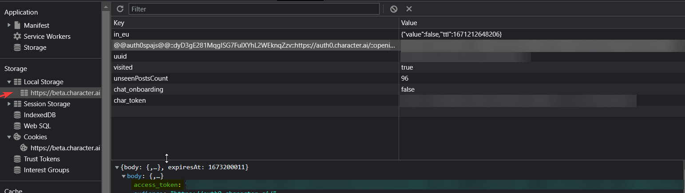
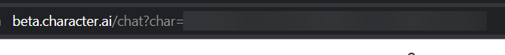

# Character AI Unofficial API

> Node.js client for the unofficial [Character AI API](https://character.ai/).

## Intro

This is a Node.js client for the unofficial Character AI API. It is not affiliated with Character AI in any way. It is a community project. TS typings are included.

You can use it to start building projects powered by your CharacterAI entitites, like chatbots, websites, etc.

## Installation

```bash
npm install node-character.ai
```

Usage

```ts
// You can find this test script in the src folder
import CharacterAI from 'node-character.ai';

export class Test {
  public static async sendMessage(message: string): Promise<void> {
    const characterAi = new CharacterAI();
    // accessToken is required; keep reading for details.
    await characterAi.authenticate(process.env.CHARACTERAI_TOKEN);

    // you can find your characterId in the URL of a Character's chat page. Keep reading for details.
    const chat = await characterAi.continueOrCreateChat(
      process.env.CHARACTERAI_CHARID,
    );

    // send a message and wait for the response
    const response = await chat.sendAndAwaitResponse({
      message,
      singleReply: true, // if you want just what would show up in the chat, set this to true
    });

    // response can be either an array of possible responses or a single response
    console.log(response);
  }
}

Test.sendMessage('Greetings! What are your plans for today?');
```

## Access Token

This package requires a valid session token from Character AI. You can get one by logging in to your Character AI account and copying the value of the `accessToken` in the `localStorage` of your browser.

1. Open the Character AI website in your browser
2. Open the developer tools `F12` and go to the `Application` tab.
3. Go to the `Storage` section and click on `Local Storage`.
4. Look for the `@@auth0spajs@@::dyD3gE281MqgISG7FuIXYhL2WEknqZzv::https://auth0.character.ai/::openid profile email offline_access` key.
5. Open the body and copy the access token.



## Character ID

You can find your character ID in the URL of a Character's chat page. For example, if you go to the chat page of the character `Test Character` you will see the URL `https://character.ai/chat/chat?char=5f7f9b9b9b9b9b9b9b9b9b9b`. The last part of the URL is the character ID:


